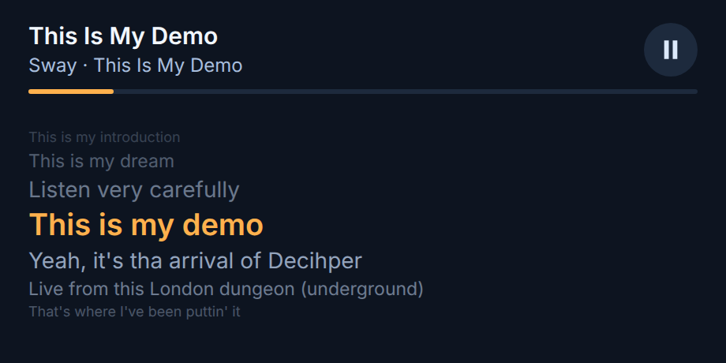
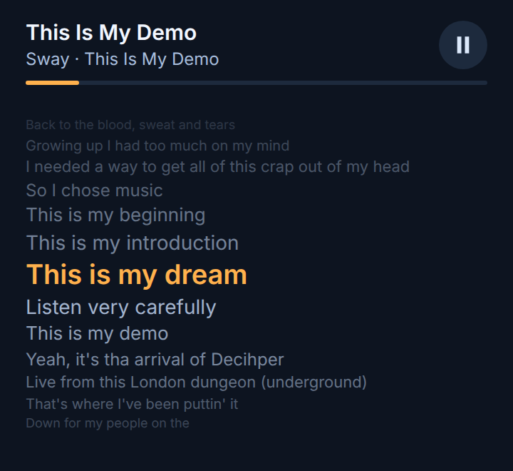
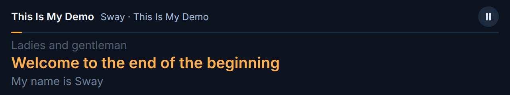
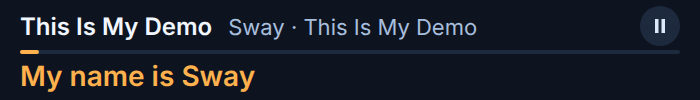

# seesongs

A small floating window showing the song that's playing, with its lyrics in
time.



It reads the current track from any MPRIS player (Spotify, browsers, mpv and
most Linux music apps) and fetches lyrics from [LRCLIB](https://lrclib.net).

## Sizes

The layout follows the window. Taller windows show more of the song, fading
with distance from the current line:



Short windows put the title, artist and album on one row:



Down to a 50px bar with only the current line:



## Lyrics

- Timed lyrics from LRCLIB are used when they match the track's length.
- Timed lyrics from other recordings, usually live ones, are not used directly.
- Lyrics without timings are paced from timed recordings of other lengths:
  the gaps between sung lines are copied, and the breaks between sections
  stretch or shrink to fit the track.
- Failing that, lines are spread evenly over the track.
- Tracks marked instrumental say so.

## Requirements

- `playerctl`
- Rust, plus the Dioxus desktop libraries. On Debian and Ubuntu:

  ```
  sudo apt install playerctl libwebkit2gtk-4.1-dev libxdo-dev libssl-dev
  ```

## Running

```
cargo run --release
```

For live reload while working on it, `dx serve --platform desktop`.

The window is titled `Now Playing`. In sway, to float it and keep it on every
workspace:

```
for_window [title="^Now Playing$"] floating enable, sticky enable
```

## Browsers

Chrome and Firefox pass on whatever the page sets with the Media Session API.
Pages that set nothing show only the tab title. Bandcamp's embedded player is
one of these.

## Screenshots

The screenshots render the window's own markup at moments of Sway's
"This Is My Demo", with lyrics from LRCLIB. To regenerate them (needs
Google Chrome and jq):

```
screenshots/shoot.sh
```
